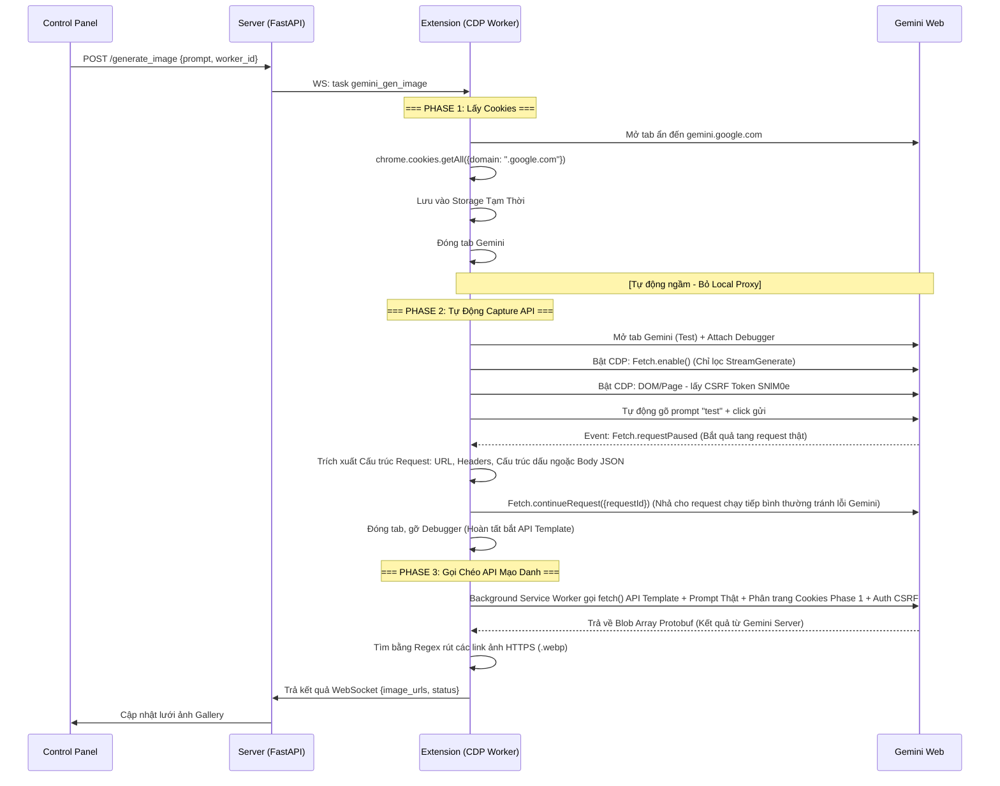

# Quy Trình Tích Hợp Gemini Image Gen vào Extension CDP

## Tổng Quan

Gộp chức năng Cookie Grabber + CDP Worker thành **1 Extension duy nhất**. Khi Server giao task `gemini_gen_filter`, Extension thực hiện **3 phases tuần tự** bên trong trình duyệt rồi trả kết quả (URL ảnh) về Server.

**ĐIỂM ĐẶC BIỆT CỦA PHƯƠNG PHÁP NÀY (SO VỚI TOOL GỐC):**
- **Nginx/MitmProxy Đã Bị Loại Bỏ:** Không cần cài đặt project `reverse_api_web` trên máy tính local. Không có chạy port proxy.
- **Không Cài Chứng Chỉ (CA Cert):** Extension bắt request trực tiếp từ nhân trình duyệt (native browser level) trước khi bị mã hoá HTTPS. Nên không cần rắc rối cài file `.crt` thủ công.
- **Sử Dụng Native CDP Fetch API:** Thay vì dùng proxy ngoài, extension dùng API gốc `chrome.debugger` (CDP) để tự động hóa hoàn toàn.
- **100% Plug & Play:** Người dùng chỉ cần cài Extension, đăng nhập Google, phần còn lại Server và Extension lo liệu.

---

## Kiến Trúc Tổng Thể



---

## Chi Tiết Từng Bước Các Luồng

### PHASE 0 — Khởi Tạo (Chờ Lệnh Server)

```json
// Cấu trúc Data WebSocket Server Socket Gửi Sang Extension (Nút Worker):
{
  "type": "task",
  "task": {
    "id": "task_img_999",
    "name": "Gemini Image Gen",
    "steps": [
      {
        "action": "gemini_gen_image",
        "params": {
          "prompt": "Vẽ hình một con sóc ninja đang ăn pizza, phong cách anime"
        }
      }
    ]
  }
}
```

Script Executor của Extension nhận Lệnh, phân tích tên `gemini_gen_image` để gọi Handler (`gemini-image-gen.js`).

---

### PHASE 1 — Luồng 1: Crawl Google Session Cookies

**Mục tiêu:** Lấy toàn bộ Phiên đăng nhập (`__Secure-1PSID`, v.v.) mà hoàn toàn không cần can thiệp copy-paste thủ công.

**Các bước cụ thể:**

| # | Bước kỹ thuật | Diễn giải |
|---|---------------|-----------|
| 1.1 | Kiểm tra Auth | Dùng `chrome.cookies.get({ "url": "https://gemini.google.com", "name": "__Secure-1PSID" })`. Nếu không tồn tại -> Lỗi 401 "Chưa Login". Báo thất bại về server. |
| 1.2 | Đóng/Mở Tab Giấu Kín | Tạo tab url Gemini. |
| 1.3 | Xuất toàn bộ Cookie | Dùng `chrome.cookies.getAll({ "domain": ".google.com" })`. Duyệt array và nối thành chuỗi thuần: `key1=value1; key2=value2;` |
| 1.4 | Gắn Memory Cache | Lưu vào global variable để dùng cho Phase 3. Không dùng disk write. |

---

### PHASE 2 — Luồng 2: Intercept CDP - Khám Phá Cấu Trúc Payload Động (Thay Thế Proxy)

**Mục tiêu:** Giao diện Gemini web update Cấu trúc API rất thường xuyên (RPC id, format array, param query). Ta dùng CDP ép trình duyệt tự gửi một gói tin thử nghiệm bằng Script Automation, rồi dùng Fetch.enable() để "**hứng**" gói tin đó trước khi nó rời máy. Từ đó phân tích ra Template Request Mới Nhất. 

**Hoạt động:**

| # | Lệnh gọi | Kết quả / Hành động |
|---|----------|---------------------|
| 2.1 | `chrome.tabs.create` | Mở https://gemini.google.com |
| 2.2 | `chrome.debugger.attach` | Phiên bản 1.3 CDP attached vào tab đó. |
| 2.3 | **`Fetch.enable`** | Filter: `{urlPattern: "*BardFrontendService/StreamGenerate*", requestStage: "Request"}`. Bật bẫy. |
| 2.4 | `Runtime.evaluate` | Chạy Script trên trang web để tìm key CSRF gọi là `SNlM0e`. Token này bắt buộc có trong URL Query. |
| 2.5 | Automation Input | Gõ chữ "1" vào thanh chat, Bấm phím Enter (bằng `Input.dispatchKeyEvent`). |
| 2.6 | **Bắt `Fetch.requestPaused`** | Extension nhận được Request gốc mà Web vừa định gửi đi. |
| 2.7 | Trích Xuất Template | Record lại `request.url`, `request.headers`, `request.postData`. Trích Object làm API Boilerplate gốc. Lắng nghe `Network.responseReceived` để biết Content-Type chuẩn từ Google. |
| 2.8 | `Fetch.continueRequest` | Phát lệnh thả Request đi (hoặc abort nếu đã đủ data) & Tắt tab test. |

**Bảo Mật:** Quá trình diễn ra trong 1 giây trên tab Chrome của user, hoàn toàn ẩn dật và dùng API gốc, không dùng port ngoài.

---

### PHASE 3 — Fake Request & Lọc Ảnh

**Mục tiêu:** Build Request API theo chuẩn mới lấy ở Phase 2, Gắn Token + Gắn Cookies Phase 1 + Gắn Prompt gốc của Bot Control Panel giao. Phát API ngay nền Background Worker.

| # | Chi Tiết Kỹ Thuật | Hành Động |
|---|-------------------|-----------|
| 3.1 | Regex Repleacement | Sửa Array JSON từ template postData bước 2.7 (thay chuỗi "1" bằng "Vẽ hình một con sóc ninja đang ăn pizza, phong cách anime"). |
| 3.2 | Gắn Cookies Header | Headers request =  bộ custom Headers ở phase 2 + chuỗi Session Cookies (Phase 1). |
| 3.3 | Bắn API Trực Tiếp | Do Service Worker manifest v3 hay chặn CORS, mở 1 tab rỗng ẩn `Offscreen/Injected Script` ở Google.com -> Dùng `window.fetch(url, options)`. |
| 3.4 | Receive Async Stream | Dữ liệu trả về chuẩn RPC Array Protocol nhiều Array lồng nhau. Parse chuỗi String JSON thô. |
| 3.5 | Regex Parser HTTP | Chạy lệnh Regex bắt URL: `/(https:\/\/lh3\.googleusercontent\.com\/[a-zA-Z0-9_-]+)/g` loại các link profile icon. Return Mảng Array Link (Ảnh Gốc Mới Tạo). |

Đóng gói Array URL ảnh -> Server lưu Database.

---

## Chi Tiết Module Cần Code

- **1. `/extension/manifest.json`**:
   Sửa để hỗ trợ CDP Debugger và Cookie host permission:
   ```json
   "permissions": ["debugger", "tabs", "cookies", "scripting"],
   "host_permissions": ["*://*.google.com/*", "*://gemini.google.com/*"]
   ```
- **2. `/extension/modules/actions/gemini-image-gen.js` (NEW)**:
  Tạo class logic hoàn chỉnh theo cấu trúc async Promise xử lý 3 luồng (GetCookie, CaptureTemplateCDP, GenerateRealPrompt).
- **3. `/app/routes.py` + `/app/tasks.py` (Backend FastApi)**:
   Mở endpoint Route `POST /gen-img` cho UI. Server đẩy Socket JSON chuẩn như Phase 0. Nhận ảnh Json list Array ghim vào CSDL.
- **4. UI Control Panel `index.html` `main.js`**:
   Khu vực nhập Text "Draw me..." -> Gọi `POST /gen-img` -> Nhận Array hình -> Append tag ``.

---

## Tối Ưu Tốc Độ Thực Yến & Catching Alert

1. Chạy full 3 bước mất tầm **12-25 Giây** cho lần đầu do mở tab test.
2. **Hệ Thống Cache Phase 2:** Api endpoint template, và SNlM0e Token có hạn dùng khoảng trên vài chục phút. Lần gọi thứ 2, Extension kiểm tra nếu Template Cache chưa bị huỷ -> **Sửa Phase 1 nhảy thẳng Phase 3**. Tốc độ chỉ còn **2-5 Giây**.
3. **Fail-Safe Mechanism:** Nếu Fast-Call Phase 3 báo mã Code `403` hoặc rỗng `[]` url. Auto Flush Cache, reset gọi lại Phase 2 capture Payload mới.
4. **Error Bubble:** Trả lỗi WebSocket về C.Panel bằng text UI chuẩn: "Client Worker (ID) Session Expired. Hãy đăng nhập Google" hoặc "Gemini API Blocked Image Policy".
